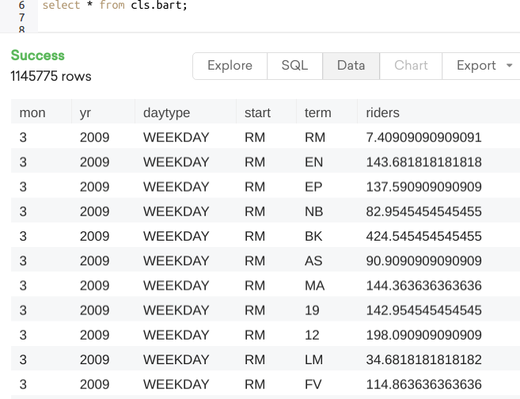

# BART Monthly Ridership Reports
Clean and process messy BART data and import into PostgreSQL

The data can be found here: https://www.bart.gov/about/reports/ridership

Once the data is loaded, it should look like the following:

# Tutorial

To run the Python script, simply run ``python bart_clean_postgres.py`` after specifying
the schema information and data directory. An example is seen in the commented code at the bottom.

[(In Progress) Follow-up Data Visualization Analysis](https://github.com/dongchris/bart-data-visualization) 